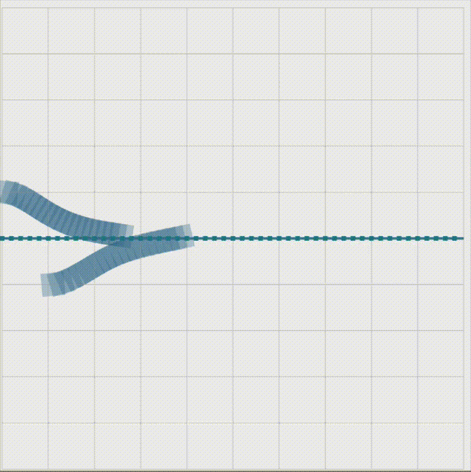
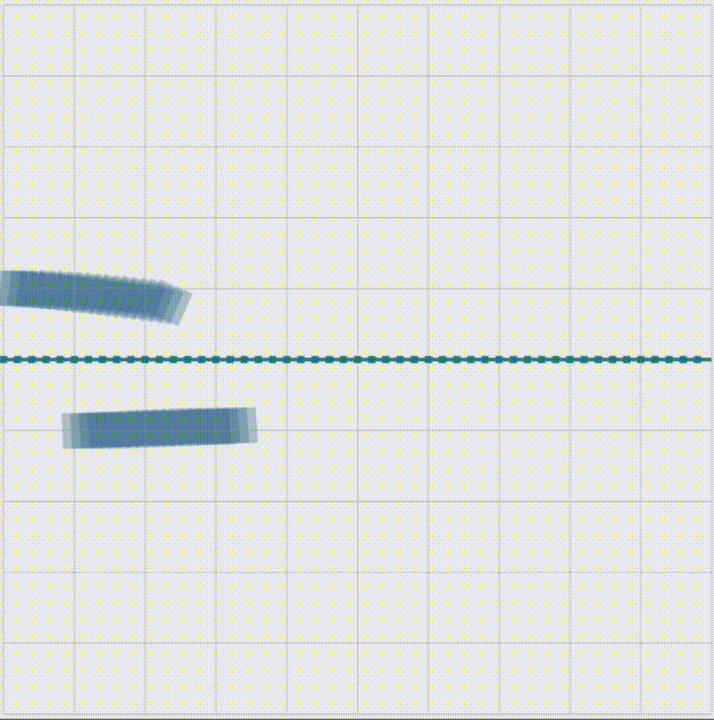
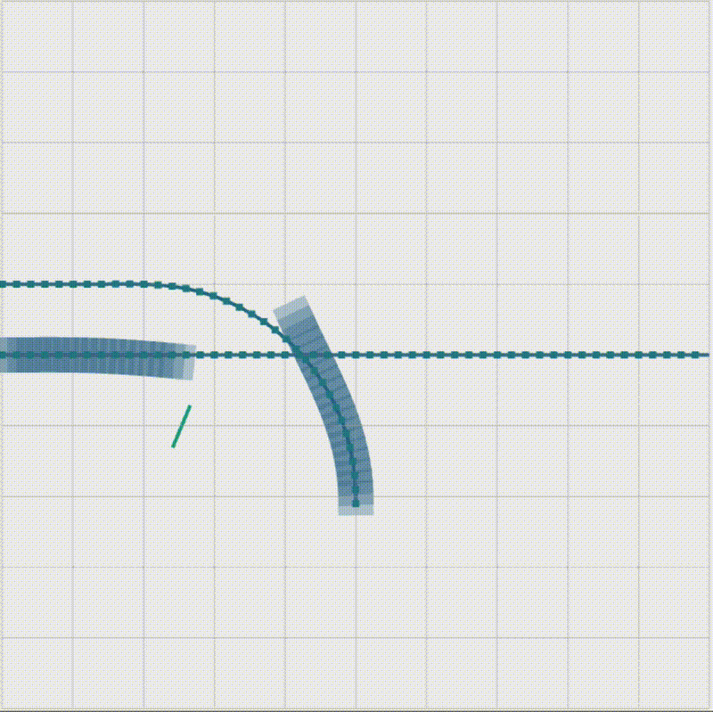
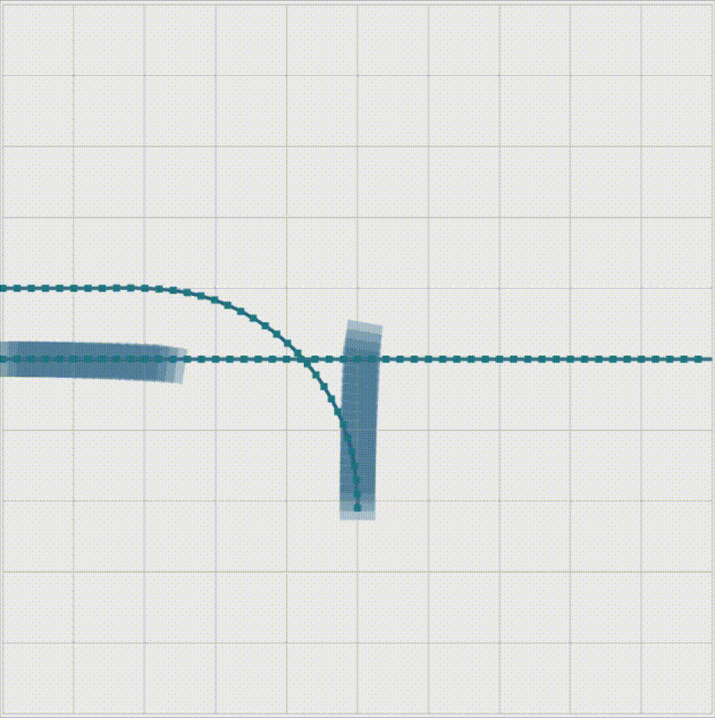

# Distributed Multi-Vehicle Coordination Algorithm

This repository implements a **Distributed Multi-Vehicle Coordination Algorithm** for cooperative motion planning in merging and t-junction scenarios. Each vehicle runs a nonlinear MPC (NMPC) with contouring control optimization and a collision avoidance (CA) optimization per iteration. The optimizations are solved using the open-source [ACADOS](https://github.com/acados/acados) software. The controller can be run in closed-loop with the [DART simulator](https://github.com/Lorenzo-Lyons/DART.git).

---

## Features

- Distributed and centralized cooperative motion planning
- Nonlinear MPC with contouring control and collision avoidance
- Configurable scenarios (merging, t-junction, etc.)
- Integration with DART simulator for closed-loop testing
- Visualization in RViz
- Docker support for easy setup

---

## Installation

### Prerequisites

- **ROS1** (Noetic recommended).  
  Alternatively, use the provided Docker setup (see [docker-files](docker-files/)).
- **ACADOS**: See below for installation instructions.
- Python dependencies: see [`pyproject.toml`](pyproject.toml).

### Install ACADOS

See the [README section](README.md) or run:

```bash
git clone https://github.com/acados/acados.git
cd acados
git submodule update --recursive --init
mkdir -p build
cd build
cmake -DACADOS_WITH_QPOASES=ON -DACADOS_SILENT=ON ..
make install -j4
```

Add to your `~/.bashrc`:

```bash
export LD_LIBRARY_PATH="$LD_LIBRARY_PATH:<path_to_acados>/lib"
export ACADOS_SOURCE_DIR="<path_to_acados>"
```


**Note:** The Dockerfile already includes installation of ACADOS, so no manual installation is required when using the Docker image.

### Install Python Dependencies


**Note:** All Python dependencies are managed via `pyproject.toml` and installed with `poetry install`.

```bash
poetry install
```

Or, using pip and requirements.txt:

```bash
python3 -m venv .venv --system-site-packages
source .venv/bin/activate
pip install -r requirements.txt
```

### ROS Workspace Setup

- Clone this repository into your ROS workspace's `src/` directory.
- Clone [dart_simulator_pkg](https://github.com/Lorenzo-Lyons/DART.git) into `src/`.
- Build the workspace:

```bash
catkin_make
source devel/setup.bash
```

- Install additional ROS packages as needed, e.g.:
  ```bash
  sudo apt-get install ros-noetic-robot-localization
  ```

---

## Docker Usage

Docker support is provided for easy setup and reproducibility.  
See [`docker-files/`](docker-files/) for:

- [`dmpc_container.Dockerfile`](docker-files/dmpc_container.Dockerfile): The main Dockerfile for the DMPC planner environment.
- [`docker-compose.yml`](docker-files/docker-compose.yml): Example setup for running the planner and a noVNC server for graphical output.

### Build and Run with Docker

```bash
cd docker-files
docker build -f dmpc_container.Dockerfile -t dmpc_planner:latest ..
docker-compose up
```

- The `novnc` service exposes a web-based desktop at [http://localhost:8080](http://localhost:8080) for RViz and GUI tools.

A pre-built Docker image is available at:
hubertvisser/multi_vehicle_coordination_algorithm:latest

You can pull and run it directly:

```bash
docker pull hubertvisser/multi_vehicle_coordination_algorithm:latest
docker run --rm -it hubertvisser/multi_vehicle_coordination_algorithm:latest
```
---

## Usage

1. **Configure the scenario and hyperparameters**  
   Edit [`multi_vehicle_coordination_algorithm/config/settings.yaml`](multi_vehicle_coordination_algorithm/config/settings.yaml) to set:
   - Scenario (track_choice)
   - Number of vehicles
   - Horizon, weights, open/closed-loop, etc.
   - Centralized or distributed mode
   - Number of control steps (iterations)

2. **Select algorithm (centralized/distributed)**  
   The launch wrapper (`multi_vehicle_coordination_algorithm/launch_wrapper.py`) will select the correct launch file based on your settings.

3. **Run the algorithm**  
   After building and sourcing your workspace, launch with:

   ```bash
   roslaunch multi_vehicle_coordination_algorithm multi_vehicle_coordination_algorithm.launch
   ```

   The online trajectories will be shown in RViz.

4. **Docker Usage**  
   See above for Docker instructions. For graphical output, you can use the provided noVNC setup.

5. **Results**  
   After the specified number of control steps, the simulation stops and results (trajectories, plots, etc.) are saved in:
   ```
   multi_vehicle_coordination_algorithm/scripts/{centralised-algorithm|distributed-algorithm}/plots/
   ```
### Example RViz Output

<table>
  <tr>
    <th>Merging Centralised</th>
    <th>Merging Distributed</th>
  </tr>
  <tr>
    <td></td>
    <td></td>
  </tr>
</table>

<table>
  <tr>
    <th>T-junction Centralised</th>
    <th>T-junction Distributed</th>
  </tr>
  <tr>
    <td></td>
    <td></td>
  </tr>
</table>

---

## Project Structure

- `multi_vehicle_coordination_algorithm/scripts/centralised-algorithm/`  
  Centralized controller scripts
- `multi_vehicle_coordination_algorithm/scripts/distributed-algorithm/`  
  Distributed controller scripts
- [`mpc_planner_modules`](mpc_planner_modules/)  
  Helper modules for MPC and constraints
- [`mpc_planner_msgs`](mpc_planner_msgs/)  
  Custom ROS messages
- [`solver_generator`](solver_generator/)  
  Solver/model generation utilities
- [`multi_vehicle_coordination_algorithm/config/settings.yaml`](multi_vehicle_coordination_algorithm/config/settings.yaml)  
  Main configuration file
- [`docker-files/`](docker-files/)  
  Dockerfile and docker-compose for containerized setup

---

## Configuration

All main settings are in [`multi_vehicle_coordination_algorithm/config/settings.yaml`](multi_vehicle_coordination_algorithm/config/settings.yaml).

---

## Special Notes

- **Currently, only 2 vehicles are fully supported.**  
  Support for more vehicles is under development.
- **Algorithm variants:**  
  - DMPC-RCA and centralized algorithms are in the default `main` branch.
  - The consensus algorithm (DMPC-RCA-C) is in the `lambda_consensu_algorithm` branch.

---

## Contact

For questions or contributions, please contact [Hubert Visser](mailto:hubertvisser@icloud.com)